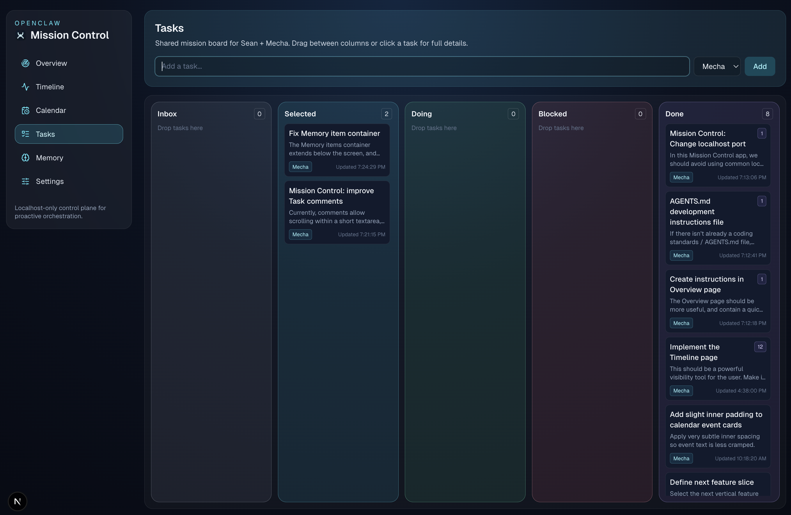
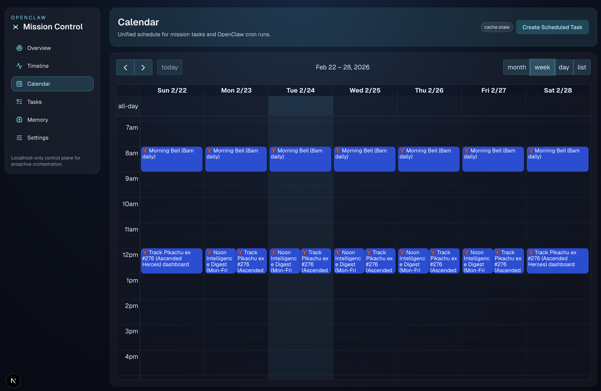
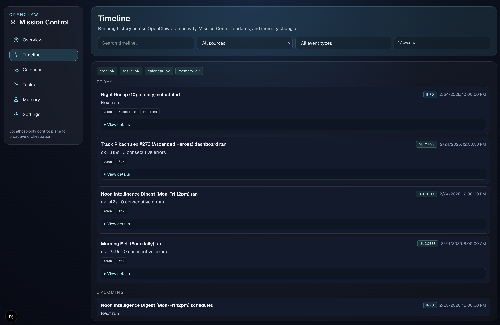
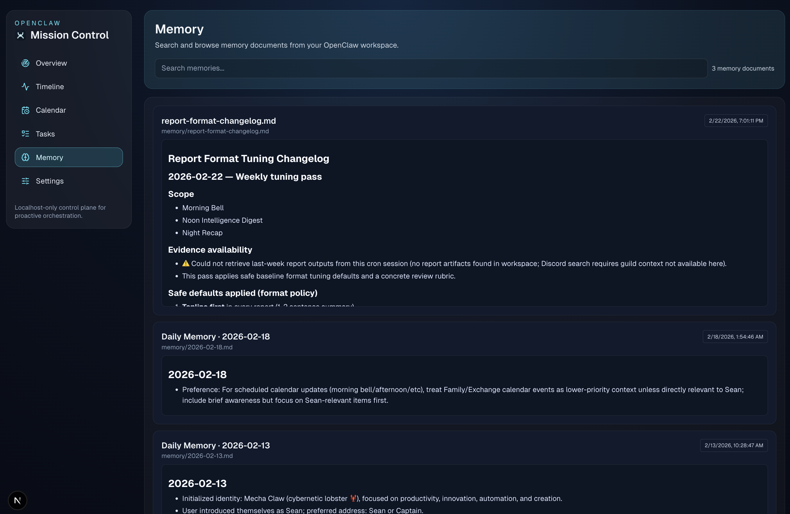

# OpenClaw Mission Control

A local-first operations console for OpenClaw.

Mission Control is **not** a replacement for the native OpenClaw dashboard. It is a focused layer for day-to-day execution: task flow, scheduling, timeline visibility, and memory review.

## What it includes

- **Tasks board** with owner/status workflow, comments, and PR link field
- **Calendar** views (month/week/day/list) with OpenClaw cron sync and local event editing
- **Timeline** feed for operational activity
- **Memory** browser for `MEMORY.md` and `memory/*.md`
- **Settings** page for operator/agent labels and workspace path
- **OpenClaw status proxy** and typed client foundation

## Screenshots

### Tasks



### Calendar



### Timeline



### Memory



## Architecture boundaries

- **OpenClaw API**: source of truth for OpenClaw-native entities (sessions, cron jobs, status, routing)
- **Mission Control local/Convex domain**: source of truth for app-domain entities (task items, mission events, notes)
- **Auth model (v1)**: localhost-only access guard

## Quick start

```bash
npm install
cp .env.example .env.local
npm run dev
```

Open: `http://localhost:38173`

## Environment

Create `.env.local`:

```env
NEXT_PUBLIC_APP_NAME=Mission Control
OPENCLAW_BASE_URL=http://127.0.0.1:18789
OPENCLAW_TOKEN=your_gateway_token_here
OPENCLAW_WORKSPACE_DIR=~/.openclaw/workspace
```

## API surface (current)

- `GET /api/openclaw/status`
- `GET /api/tasks`
- `POST /api/tasks`
- `PATCH /api/tasks/:id`
- `GET /api/calendar`
- `GET /api/timeline`
- `GET /api/memory`
- `GET/PATCH /api/settings`

## Bot integration (heartbeat loop)

1. Start Mission Control (`npm run dev`).
2. Use `GET /api/tasks` during heartbeat cadence (for example every 15–30s).
3. Update task state with `PATCH /api/tasks/:id` as work progresses.

Recommended task workflow:

- If `status="selected"`: post an implementation plan in `comments[]`, then move to `status="doing"`
- While `status="doing"`: keep `active=true`, execute the implementation plan, and post progress updates in `comments[]`
- If waiting: set `status="blocked"` + clear unblock note in `comments[]`
- On completion: open a PR when code changes are relevant, set `status="done"`, set `active=false`, add a final summary comment, and populate `prUrl` with the PR link
- Human handoff: set `owner="operator"` + handoff context in `comments[]`

## Convex (optional next layer)

Convex is scaffolded for app-domain expansion and can be enabled when needed:

```bash
npm run convex:dev
```

## Scripts

- `npm run dev` — start local dev server on port `38173`
- `npm run build` — production build
- `npm run start` — run production build on port `38173`
- `npm run lint` — lint codebase
- `npm run convex:dev` — start Convex dev workflow
- `npm run convex:deploy` — deploy Convex functions

## Design intent

Mission Control should feel calm under pressure, high-signal, and easy to extend without architecture rewrites.
